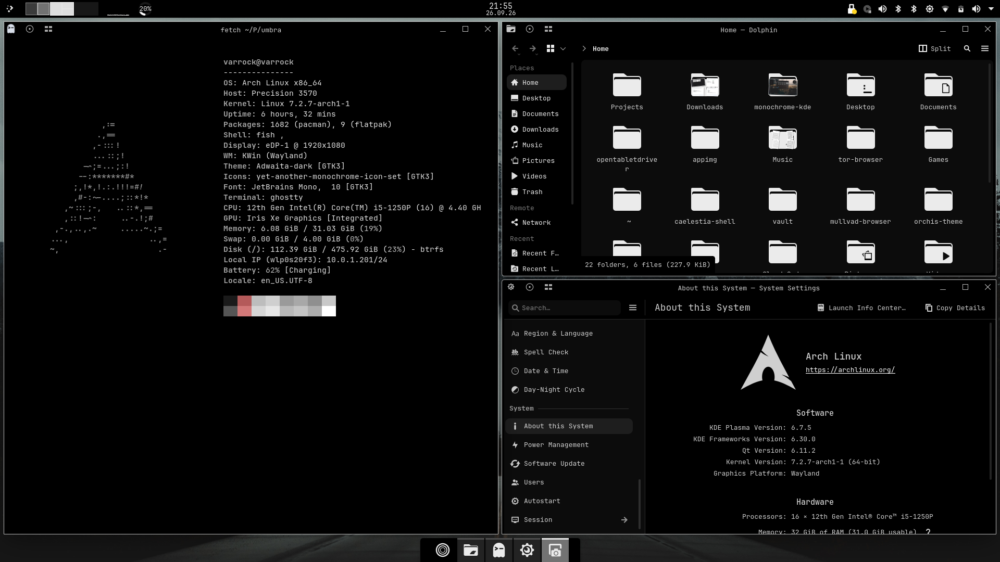

# Umbra

*The darkest part of a shadow.*

A monochrome KDE Plasma 6 rice. Pure black surfaces, white accents, thin white window outlines, a slim top bar and a floating dock. No transparency, no colored icons, nothing that distracts.



## What's in it

| Part | Used here |
| --- | --- |
| Color scheme | Umbra (included, `colors/`) |
| Application style | Breeze |
| Window decoration | [Klassy](https://github.com/paulmcauley/klassy) with a white window outline, no borders |
| Plasma style | Breeze (follows the color scheme) |
| Icons | [YAMIS](https://bitbucket.org/dirn-typo/yet-another-monochrome-icon-set) (Yet Another Monochrome Icon Set) |
| Font | JetBrains Mono / JetBrainsMono Nerd Font |
| Terminal | [Ghostty](https://ghostty.org) (config included, `ghostty/`) |
| Window gaps | [Quick Tile Gaps](https://github.com/NasreddinHodja/quicktilegaps) KWin script |
| Backup tool | [konsave](https://github.com/Prayag2/konsave) |

Tested on Arch Linux with Plasma 6.7.5 on Wayland. Any Arch-based distro with Plasma 6.6 or newer should work.

## Quick install

You need an Arch-based system, KDE Plasma 6 and an AUR helper (`yay` or `paru`).

```sh
git clone https://github.com/MrGilfy/umbra.git
cd umbra
./install.sh
```

The script installs all packages, copies the configs and applies colors, application style, window decoration and icons. Existing config files it touches are backed up to `~/.local/state/umbra-backup/`. After the script finishes, only three things are left to do by hand: the fonts (step 6), the panels (steps 7 and 8) and the wallpaper. Everything else is already configured.

**Tip:** back up your current setup before you start:

```sh
konsave -s before-umbra
```

You can always go back with `konsave -a before-umbra`.

## Manual setup

If you prefer doing everything yourself, or want to understand what the script does, follow these steps in order.

### 1. Color scheme

```sh
mkdir -p ~/.local/share/color-schemes
cp colors/Umbra.colors ~/.local/share/color-schemes/
plasma-apply-colorscheme Umbra
```

In System Settings > Colors, set the accent color to **"Accent color from color scheme"**, otherwise Plasma keeps its blue highlight.

Window backgrounds are `#000000`. Text fields and content areas are a very dark grey (`#0c0c0c`) and buttons a slightly lighter grey (`#242424`), so you can still see where to click and type. Selections are a medium grey (`#3c3c3c`) with white text, so the white monochrome icons stay visible.

### 2. Application style: Breeze

In System Settings > Colors & Themes set **Application Style** to **Breeze** and **Plasma Style** to plain **Breeze** (not Breeze Dark).

Breeze is the only style that follows the color scheme everywhere, including hover and selection colors in menus. Other styles like Darkly or Kvantum themes bring their own highlight colors, which end up bright white with Umbra and make menu entries unreadable.

### 3. Window decoration: Klassy

```sh
yay -S klassy
```

In System Settings > Window Decorations select Klassy. **Don't** apply the Klassy global theme, it would overwrite the colors, style and icons.

- Set the border size to **No Borders**.
- Open Klassy's settings (pencil icon), enable the **window outline** and set its color to **Accent colour**. Since the accent is white, every window gets a thin white line.


If `klassy/klassyrc` exists in this repo, copy it to `~/.config/klassy/klassyrc` to get the exact Klassy settings used here.

### 4. Gaps around maximized windows

The white outline is hidden behind the panels when a window is maximized. The Quick Tile Gaps script adds a small gap around maximized and quick-tiled windows so the outline stays visible all around.

```sh
git clone https://github.com/NasreddinHodja/quicktilegaps.git
kpackagetool6 --type=KWin/Script -i quicktilegaps
```

Enable it in System Settings > Window Management > KWin Scripts and leave the gap size on its default, or adjust it to taste.

### 5. Icons

```sh
yay -S yamis-icon-theme-git
```

Select YAMIS in System Settings > Icons. Folders, file icons and app icons are all monochrome and follow the color scheme.

### 6. Fonts

```sh
sudo pacman -S ttf-jetbrains-mono ttf-jetbrains-mono-nerd
```

System Settings > Fonts > **Adjust All Fonts** > JetBrains Mono, Regular, 10 pt. Set the fixed width font to JetBrains Mono too.

### 7. Top bar

Right-click the desktop > Enter Edit Mode > Add Panel > Empty Panel.

- Position: Top, height about 28, opacity **Opaque**, floating **off**
- Widgets from left to right: Application Launcher, Pager, CPU Usage, Memory Usage, Panel Spacer, Digital Clock, Panel Spacer, System Tray

Tweaks:

- **Pager:** show the desktop number, no window icons. Add desktops in System Settings > Virtual Desktops.
- **CPU / Memory:** give them different styles so they're easy to tell apart, e.g. CPU as "Line Chart" and Memory as "Text Only", or pick a white and a grey sensor color.

Third-party pager widgets like Kara or the "Desktop Indicator" plasmoids from the KDE Store are broken since Plasma 6.6 because they depend on a private module that no longer exists. The built-in Pager works fine.

### 8. Floating dock

Take the default bottom panel and remove everything except the icon task manager (launcher, tray, clock, show desktop).

Panel settings: width **Fit Content**, centered, floating **on**, opacity **Opaque**, height about 44, visibility **Dodge Windows** if you like.

### 9. Terminal: Ghostty

```sh
sudo pacman -S ghostty
mkdir -p ~/.config/ghostty
cp ghostty/config.ghostty ~/.config/ghostty/config.ghostty
```

The config uses a pure black background, a greyscale palette with a muted red for errors, JetBrains Mono Nerd Font, no close or paste warnings, and lets KWin draw the titlebar so Ghostty matches every other window.

Ghostty takes a moment for a cold start. Run it as a background service so new windows open instantly:

```sh
systemctl --user enable --now app-com.mitchellh.ghostty.service
```

The config already contains `quit-after-last-window-closed = false`, so the service keeps running after you close the last window.

If you use Konsole instead, copy `konsole/Umbra.colorscheme` to `~/.local/share/konsole/` and select it in your profile.

### 10. Wallpaper

Any moody greyscale photo works: misty mountains, dark forests, statues. Desaturate a photo you like if you can't find one.

Wallpaper used in the screenshot: [wallhaven m96qky](https://wallhaven.cc/w/m96qky).

## Restoring with konsave

If a konsave export is included in `konsave/`, it contains the panel layout and Plasma settings:

```sh
konsave -i konsave/umbra.knsv
konsave -a umbra
```

Log out and back in afterwards.

## Credits

- [Klassy](https://github.com/paulmcauley/klassy) by paulmcauley
- [YAMIS icon theme](https://bitbucket.org/dirn-typo/yet-another-monochrome-icon-set)
- [Quick Tile Gaps](https://github.com/NasreddinHodja/quicktilegaps) by NasreddinHodja
- [Ghostty](https://ghostty.org)
- [JetBrains Mono](https://www.jetbrains.com/lp/mono/) and [Nerd Fonts](https://www.nerdfonts.com)
- [konsave](https://github.com/Prayag2/konsave)

## License

The config files and scripts in this repo are MIT licensed. All linked projects keep their own licenses.
